# Titanic：Achieve 84% Accuracy()

載入相關的套件


```python
%matplotlib inline
import pandas as pd
import numpy as np
import statistics as stat
from collections import Counter
import seaborn as sns
import matplotlib.pyplot as plt
import IPython
from IPython import display
from scipy import stats
import math
from datetime import datetime
import warnings
warnings.filterwarnings('ignore')
```

讀取資料，將官方給的Train、Test dataset合併，方便日後的Feature Engineer。


```python
# Read Data
train = pd.read_csv('D:/kaggle/Titanic/train.csv', index_col='PassengerId')
test = pd.read_csv('D:/kaggle/Titanic/test.csv', index_col='PassengerId')
y = train.Survived
train = train.drop('Survived', axis=1)
df_all = pd.concat([train, test], axis=0, sort=True)
print(df_all.info())
```

    <class 'pandas.core.frame.DataFrame'>
    Int64Index: 1309 entries, 1 to 1309
    Data columns (total 10 columns):
    Age         1046 non-null float64
    Cabin       295 non-null object
    Embarked    1307 non-null object
    Fare        1308 non-null float64
    Name        1309 non-null object
    Parch       1309 non-null int64
    Pclass      1309 non-null int64
    Sex         1309 non-null object
    SibSp       1309 non-null int64
    Ticket      1309 non-null object
    dtypes: float64(2), int64(3), object(5)
    memory usage: 112.5+ KB
    None
    

# Data Cleaning

## EDA

在進行Data Cleaning之前，先進行EDA。

看一下Missing Data。從下圖得知共有4個Columns包含Missing Data。


```python
na_col = df_all.isnull().sum()
na_col = na_col[na_col > 0]
plt.subplots(figsize=(10, 5))
na_col.plot(kind='bar')
print(na_col.sort_values(ascending=False))
```

    Cabin       1014
    Age          263
    Embarked       2
    Fare           1
    dtype: int64
    


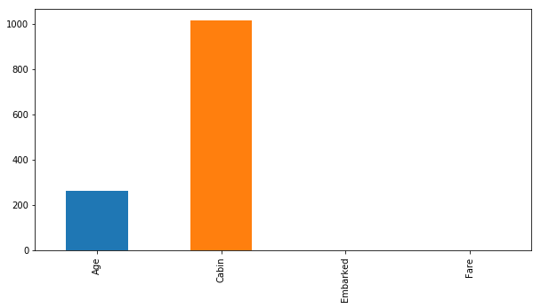


```python
fig, axis = plt.subplots(5,2,figsize=(15,30))

sns.countplot(df_all['Pclass'], ax = axis[0][0])
sns.barplot(x = 'Pclass', y = y, data = df_all, ax = axis[0][1])
sns.countplot(df_all['SibSp'], ax = axis[1][0])
sns.barplot(x = 'SibSp', y = y, data = df_all, ax = axis[1][1])
sns.countplot(df_all['Parch'], ax = axis[2][0])
sns.barplot(x = 'Parch', y = y, data = df_all, ax = axis[2][1])
sns.countplot(df_all['Sex'], ax = axis[3][0])
sns.barplot(x = 'Sex', y = y, data = df_all, ax = axis[3][1])
sns.countplot(df_all['Embarked'], ax = axis[4][0])
sns.barplot(x = 'Embarked', y = y, data = df_all, ax = axis[4][1])
```


    <matplotlib.axes._subplots.AxesSubplot at 0x2afec14be10>


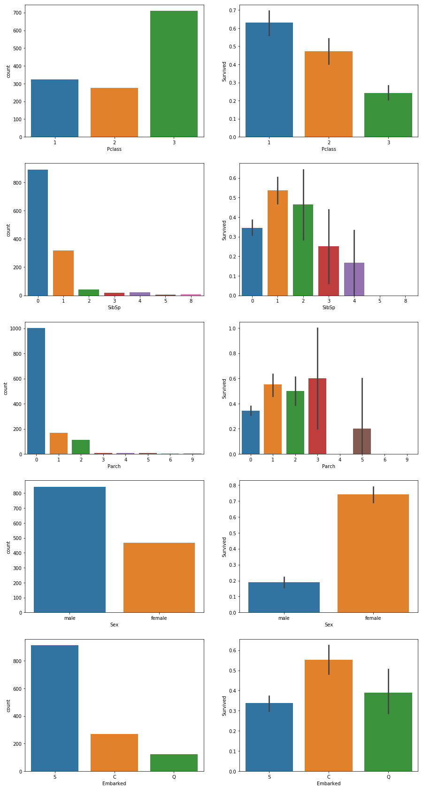


```python
plt.figure(figsize=(15,5))
plt.subplot(1,2,1)
sns.distplot(df_all.Age.dropna() , fit=stats.norm, label='Skewness=%.4f'%df_all.Age.skew());
plt.legend()
plt.subplot(1,2,2)
_=stats.probplot(df_all.Age.dropna(), plot=plt)
```


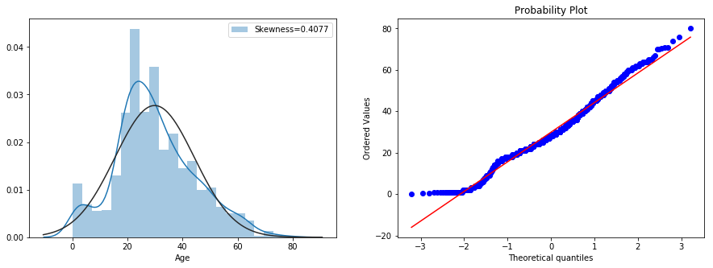


可以看到，'Fare'有Skewness的問題，會嘗試用log1p處理


```python
plt.figure(figsize=(15,5))
plt.subplot(1,2,1)
sns.distplot(df_all.Fare.dropna() , fit=stats.norm, label='Skewness=%.4f'%df_all.Fare.skew());
plt.legend()
plt.subplot(1,2,2)
_=stats.probplot(df_all.Fare.dropna(), plot=plt)
```


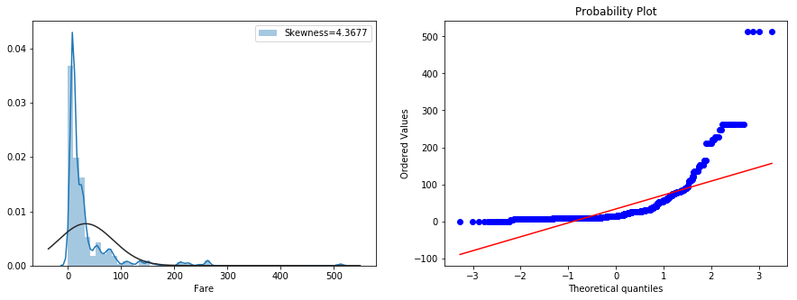


```python
# 消除Skewness
df_all['Fare'] = np.log1p(df_all['Fare'])
plt.figure(figsize=(15,5))
plt.subplot(1,2,1)
sns.distplot(df_all.Fare.dropna() , fit=stats.norm, label='Skewness=%.4f'%df_all.Fare.skew());
plt.legend()
plt.subplot(1,2,2)
_=stats.probplot(df_all.Fare.dropna(), plot=plt)
```


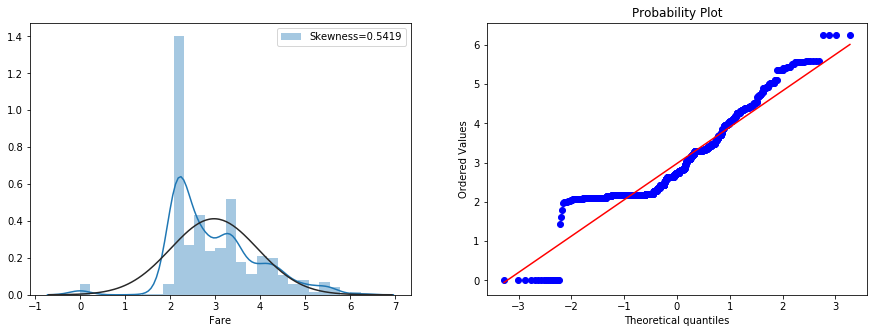


## Missing Data & Outlier

根據這一個月建模經歷以及其他Kaggler建議Missing Data與Outlier是Data Cleaning最重要的一部分。尤其是Outlier，如果要將分數往上刷一定要去除!!
首先，我先處理Outlier的部分。我將Training Data中的Outlier去除以免影響預測模型


```python
columns = train.dtypes[train.dtypes != object].index
outlier_indices = []
for col in train[columns]:
    Q1 = np.percentile(train[col], 25)
    Q3 = np.percentile(train[col], 75)
    IQR = Q3 - Q1
    outlier_col_list = train[(train[col] < Q1 - 1.5 * IQR) |
                             (train[col] > Q3 + 1.5 * IQR)].index
    outlier_indices.extend(outlier_col_list)
outlier_indices = Counter(outlier_indices)
multiple_outliers = list(k for k, v in outlier_indices.items() if v > 2)
# Drop outliers
df_all = df_all.drop(multiple_outliers, axis=0)
y = y.drop(multiple_outliers, axis=0)
```

由於Column 'Cabin'包含太多缺失值(78%)，因此我直接去除!


```python
df_all = df_all.drop(['Cabin'], axis=1)
```

Columns 'Embarked' and 'Fare'缺失值並不多，分別填入眾數以及中位數。


```python
df_all.Fare.fillna(stat.median(df_all.Fare), inplace=True)
df_all.Embarked.fillna(stat.mode(df_all.Embarked), inplace=True)
```

'Age'包含256筆缺失值，我試過用Lasso Regression來預測缺失值，但效果並不好。最後我用中位數代替(中位數非常的好用，因為可以有效的減少Skeness)


```python
df_all['Age'].fillna(df_all['Age'].median(), inplace=True)
```


```python
# overview
df_all.info()
df_all.head()
```

    <class 'pandas.core.frame.DataFrame'>
    Int64Index: 1299 entries, 1 to 1309
    Data columns (total 9 columns):
    Age         1299 non-null float64
    Embarked    1299 non-null object
    Fare        1299 non-null float64
    Name        1299 non-null object
    Parch       1299 non-null int64
    Pclass      1299 non-null int64
    Sex         1299 non-null object
    SibSp       1299 non-null int64
    Ticket      1299 non-null object
    dtypes: float64(2), int64(3), object(4)
    memory usage: 101.5+ KB
    


<div>
<style scoped>
    .dataframe tbody tr th:only-of-type {
        vertical-align: middle;
    }

    .dataframe tbody tr th {
        vertical-align: top;
    }

    .dataframe thead th {
        text-align: right;
    }
</style>
<table border="1" class="dataframe">
  <thead>
    <tr style="text-align: right;">
      <th></th>
      <th>Age</th>
      <th>Embarked</th>
      <th>Fare</th>
      <th>Name</th>
      <th>Parch</th>
      <th>Pclass</th>
      <th>Sex</th>
      <th>SibSp</th>
      <th>Ticket</th>
    </tr>
    <tr>
      <th>PassengerId</th>
      <th></th>
      <th></th>
      <th></th>
      <th></th>
      <th></th>
      <th></th>
      <th></th>
      <th></th>
      <th></th>
    </tr>
  </thead>
  <tbody>
    <tr>
      <th>1</th>
      <td>22.0</td>
      <td>S</td>
      <td>2.110213</td>
      <td>Braund, Mr. Owen Harris</td>
      <td>0</td>
      <td>3</td>
      <td>male</td>
      <td>1</td>
      <td>A/5 21171</td>
    </tr>
    <tr>
      <th>2</th>
      <td>38.0</td>
      <td>C</td>
      <td>4.280593</td>
      <td>Cumings, Mrs. John Bradley (Florence Briggs Th...</td>
      <td>0</td>
      <td>1</td>
      <td>female</td>
      <td>1</td>
      <td>PC 17599</td>
    </tr>
    <tr>
      <th>3</th>
      <td>26.0</td>
      <td>S</td>
      <td>2.188856</td>
      <td>Heikkinen, Miss. Laina</td>
      <td>0</td>
      <td>3</td>
      <td>female</td>
      <td>0</td>
      <td>STON/O2. 3101282</td>
    </tr>
    <tr>
      <th>4</th>
      <td>35.0</td>
      <td>S</td>
      <td>3.990834</td>
      <td>Futrelle, Mrs. Jacques Heath (Lily May Peel)</td>
      <td>0</td>
      <td>1</td>
      <td>female</td>
      <td>1</td>
      <td>113803</td>
    </tr>
    <tr>
      <th>5</th>
      <td>35.0</td>
      <td>S</td>
      <td>2.202765</td>
      <td>Allen, Mr. William Henry</td>
      <td>0</td>
      <td>3</td>
      <td>male</td>
      <td>0</td>
      <td>373450</td>
    </tr>
  </tbody>
</table>
</div>


# Feature Engineer

原始資料可以由人工推導出其他有用的資訊(刷分關鍵!!)接下來我換增加一些新的欄位。


```python
# Family Size(從'Parch' and 'Sibsp'其實可以知道家庭大小)
df_all['FSize'] = df_all['Parch'] + df_all['SibSp'] + 1 # +1是因為如果沒有家人自己本身

plt.figure(figsize=(15,5))
plt.subplot(1,2,1)
sns.countplot(df_all['FSize']);
plt.subplot(1,2,2)
sns.barplot(x='FSize', y=y, data=df_all)
```


    <matplotlib.axes._subplots.AxesSubplot at 0x2afec701438>


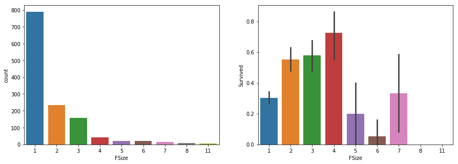


```python
# Is alone?
df_all['Alone'] = df_all['FSize'].map(lambda s: 1 if s <= 1 else 0)
plt.figure(figsize=(15,5))
plt.subplot(1,2,1)
sns.countplot(df_all['Alone']);
plt.subplot(1,2,2)
sns.barplot(x='Alone', y=y, data=df_all)
```


    <matplotlib.axes._subplots.AxesSubplot at 0x2afec6a7358>


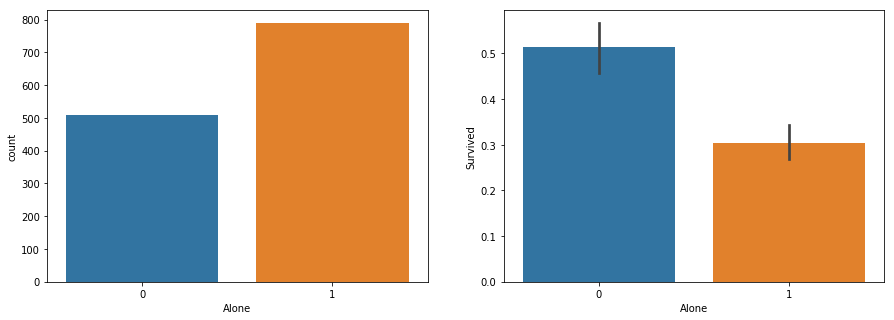


```python
# Sex & Pclass
df_all['Pclass'].replace({3: 1, 1: 3}, inplace=True)
df_all['Pclass+Sex'] = df_all['Pclass'] + df_all['Sex'].map({"male": 0, "female": 1})
plt.figure(figsize=(15,5))
plt.subplot(1,2,1)
sns.countplot(df_all['Pclass+Sex']);
plt.subplot(1,2,2)
sns.barplot(x='Pclass+Sex', y=y, data=df_all)
```


    <matplotlib.axes._subplots.AxesSubplot at 0x2afec390b00>


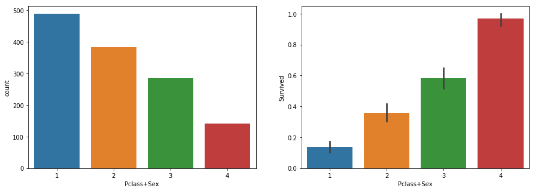


有人只使用'Name'就將成功率達到0.82左右，意味者Name欄位的重要性。學者也提出：It's important to note, more predictor variables do not make a better model, but the right variables.


```python
# New Name
df_all['Title'] = df_all['Name'].str.split(", ", expand=True)[1].str.split(".", expand=True)[0]
df_all["Title"] = df_all["Title"].replace(['Capt', 'Don', 'Major', 'Col', 'Rev', 'Dr', 'Sir', 'Mr', 'Jonkheer'], 'man')
df_all["Title"] = df_all["Title"].replace(['the Countess', 'Dona', 'Mme', 'Mlle', 'Ms', 'Miss', 'Lady', 'Mrs'], 'woman')
df_all["Title"] = df_all["Title"].replace(['Master'], 'boy')

plt.figure(figsize=(15,5))
plt.subplot(1,2,1)
sns.countplot(df_all['Title']);
plt.subplot(1,2,2)
sns.barplot(x='Title', y=y, data=df_all)
```


    <matplotlib.axes._subplots.AxesSubplot at 0x2afec69b9e8>


```python
# 可以發現，當女性和小孩姓氏相同(同一個家庭)，結局幾乎不是全罹難或是全部存活
df_all['SureName'] = df_all['Name'].str.split(", ", expand=True)[0]
df_all["SureName"] = df_all["SureName"].replace(df_all[df_all['Title'] == 'man'].SureName, 'noGroup')
df_all["SureName"] = df_all["SureName"].replace([item for item, count in Counter(df_all["SureName"]).items() if count <= 1]
                                              , 'noGroup')
group = df_all.groupby(['SureName', y])
group.size()
```


    SureName       Survived
    Abbott         1.0           1
    Aks            1.0           1
    Allison        0.0           2
                   1.0           1
    Andersson      0.0           6
                   1.0           1
    Asplund        0.0           1
                   1.0           3
    Baclini        1.0           4
    Barbara        0.0           2
    Becker         1.0           2
    Bonnell        1.0           1
    Boulos         0.0           2
    Bourke         0.0           2
    Brown          1.0           3
    Burns          1.0           1
    Cacic          0.0           1
    Caldwell       1.0           2
    Carr           1.0           1
    Carter         0.0           1
                   1.0           3
    Christy        1.0           1
    Collyer        1.0           2
    Compton        1.0           1
    Connolly       1.0           1
    Coutts         1.0           2
    Crosby         1.0           1
    Danbom         0.0           1
    Davies         1.0           1
    Dean           1.0           1
                              ... 
    Newell         1.0           2
    Nicola-Yarred  1.0           2
    Nilsson        1.0           1
    Oreskovic      0.0           1
    Palsson        0.0           4
    Panula         0.0           4
    Peter          1.0           2
    Phillips       1.0           1
    Quick          1.0           2
    Rice           0.0           5
    Richards       1.0           3
    Rosblom        0.0           1
    Ryerson        1.0           2
    Sandstrom      1.0           2
    Skoog          0.0           5
    Smith          1.0           1
    Spedden        1.0           1
    Strom          0.0           2
    Taussig        1.0           2
    Thomas         1.0           1
    Touma          1.0           1
    Van Impe       0.0           2
    Vander Planke  0.0           2
    Watt           1.0           1
    Wells          1.0           1
    West           1.0           2
    Wick           1.0           2
    Zabour         0.0           2
    noGroup        0.0         479
                   1.0         228
    Length: 96, dtype: int64


```python
# 再將Title分成細一點
df_all['Name'] = df_all['Name'].str.split(", ", expand=True)[1].str.split(".", expand=True)[0]
df_all["Name"] = df_all["Name"].replace(['Capt', 'Col', 'Don', 'Dr', 'Major', 'Rev', 'Jonkheer', 'Dona'], 'Rare')
df_all["Name"] = df_all["Name"].replace(['the Countess', 'Ms', 'Mme'], 'Mrs')
df_all["Name"] = df_all["Name"].replace(['Mlle', 'Lady', 'Mme'], 'Miss')
df_all["Name"] = df_all["Name"].replace(['Sir'], 'Mr')

plt.figure(figsize=(15,5))
plt.subplot(1,2,1)
sns.countplot(df_all['Name']);
plt.subplot(1,2,2)
sns.barplot(x='Name', y=y, data=df_all)
```


    <matplotlib.axes._subplots.AxesSubplot at 0x2afec944940>


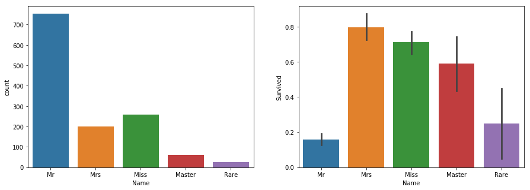


```python
# Age
bin = [0, 6, 18, 50, 80]
label = ['Baby', 'Child', 'Adult', 'Senior']
df_all['AgeGroup'] = pd.cut(df_all['Age'], bins=bin, labels=label)

plt.figure(figsize=(15,5))
plt.subplot(1,2,1)
sns.countplot(df_all['AgeGroup']);
plt.subplot(1,2,2)
sns.barplot(x='AgeGroup', y=y, data=df_all.loc[:891])
```


    <matplotlib.axes._subplots.AxesSubplot at 0x2afe9ecacf8>


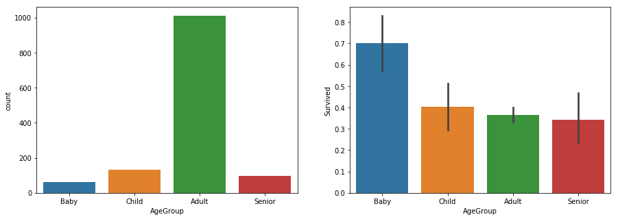


```python
# Ticket:看似是隨機變數，我直接將他移除
df_all = df_all.drop('Ticket', axis=1)
```


```python
# Fare:區分成4等分，將個數盡量保持一致
df_all['FareBin'] = pd.qcut(df_all['Fare'], 4)

plt.figure(figsize=(15,5))
plt.subplot(1,2,1)
sns.countplot(df_all['FareBin']);
plt.subplot(1,2,2)
sns.barplot(x='FareBin', y=y, data=df_all.loc[:891])
```


    <matplotlib.axes._subplots.AxesSubplot at 0x2afec329470>


```python
df_all['Survived'] = y
g = sns.pairplot(df_all, hue='Survived',palette = 'deep', size=2, diag_kind = 'kde'
                 , diag_kws=dict(shade=True), plot_kws=dict(s=10) )
g.set(xticklabels=[])
```


    <seaborn.axisgrid.PairGrid at 0x2afec9da828>


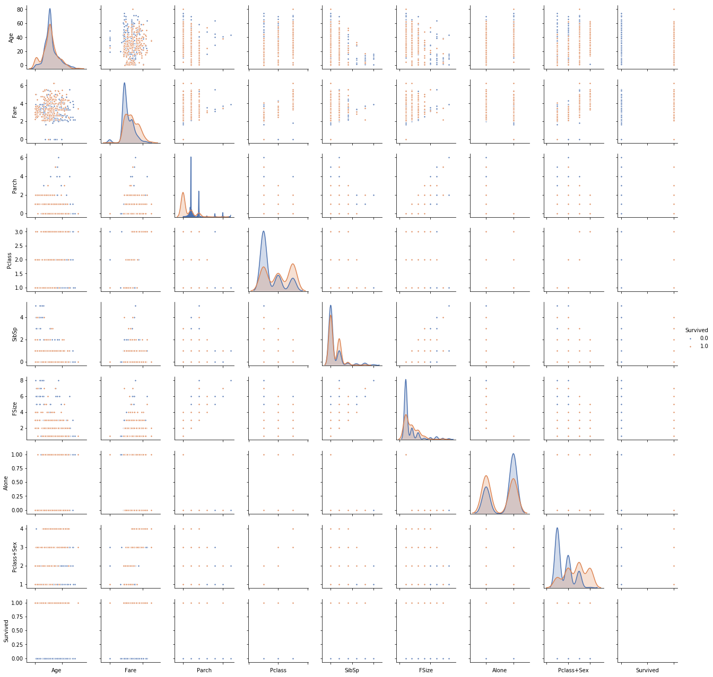


```python
# Correlation
cor = df_all.corr()
plt.figure(figsize=(15,10))
sns.heatmap(cor, cmap = 'coolwarm', annot=True, annot_kws={'fontsize':15 }, cbar_kws={'shrink':1 }
            , linewidths=0.1, vmax=1.0, linecolor='white')
```


    <matplotlib.axes._subplots.AxesSubplot at 0x2aff246b4a8>


```python
# one-hot encoding 
cols = []
cols = df_all.dtypes[df_all.dtypes == object].index
cols = cols.append(df_all.dtypes[df_all.dtypes == 'category'].index)
for col in cols:
    df_all = pd.get_dummies(df_all, columns=[col], prefix=col)

df_all.info()    
df_all.head()
```

    <class 'pandas.core.frame.DataFrame'>
    Int64Index: 1299 entries, 1 to 1309
    Columns: 129 entries, Age to FareBin_(3.453, 6.241]
    dtypes: float64(3), int64(6), uint8(120)
    memory usage: 293.7 KB
    


<div>
<style scoped>
    .dataframe tbody tr th:only-of-type {
        vertical-align: middle;
    }

    .dataframe tbody tr th {
        vertical-align: top;
    }

    .dataframe thead th {
        text-align: right;
    }
</style>
<table border="1" class="dataframe">
  <thead>
    <tr style="text-align: right;">
      <th></th>
      <th>Age</th>
      <th>Fare</th>
      <th>Parch</th>
      <th>Pclass</th>
      <th>SibSp</th>
      <th>FSize</th>
      <th>Alone</th>
      <th>Pclass+Sex</th>
      <th>Survived</th>
      <th>Embarked_C</th>
      <th>...</th>
      <th>SureName_noGroup</th>
      <th>SureName_van Billiard</th>
      <th>AgeGroup_Baby</th>
      <th>AgeGroup_Child</th>
      <th>AgeGroup_Adult</th>
      <th>AgeGroup_Senior</th>
      <th>FareBin_(-0.001, 2.186]</th>
      <th>FareBin_(2.186, 2.738]</th>
      <th>FareBin_(2.738, 3.453]</th>
      <th>FareBin_(3.453, 6.241]</th>
    </tr>
    <tr>
      <th>PassengerId</th>
      <th></th>
      <th></th>
      <th></th>
      <th></th>
      <th></th>
      <th></th>
      <th></th>
      <th></th>
      <th></th>
      <th></th>
      <th></th>
      <th></th>
      <th></th>
      <th></th>
      <th></th>
      <th></th>
      <th></th>
      <th></th>
      <th></th>
      <th></th>
      <th></th>
    </tr>
  </thead>
  <tbody>
    <tr>
      <th>1</th>
      <td>22.0</td>
      <td>2.110213</td>
      <td>0</td>
      <td>1</td>
      <td>1</td>
      <td>2</td>
      <td>0</td>
      <td>1</td>
      <td>0.0</td>
      <td>0</td>
      <td>...</td>
      <td>1</td>
      <td>0</td>
      <td>0</td>
      <td>0</td>
      <td>1</td>
      <td>0</td>
      <td>1</td>
      <td>0</td>
      <td>0</td>
      <td>0</td>
    </tr>
    <tr>
      <th>2</th>
      <td>38.0</td>
      <td>4.280593</td>
      <td>0</td>
      <td>3</td>
      <td>1</td>
      <td>2</td>
      <td>0</td>
      <td>4</td>
      <td>1.0</td>
      <td>1</td>
      <td>...</td>
      <td>1</td>
      <td>0</td>
      <td>0</td>
      <td>0</td>
      <td>1</td>
      <td>0</td>
      <td>0</td>
      <td>0</td>
      <td>0</td>
      <td>1</td>
    </tr>
    <tr>
      <th>3</th>
      <td>26.0</td>
      <td>2.188856</td>
      <td>0</td>
      <td>1</td>
      <td>0</td>
      <td>1</td>
      <td>1</td>
      <td>2</td>
      <td>1.0</td>
      <td>0</td>
      <td>...</td>
      <td>1</td>
      <td>0</td>
      <td>0</td>
      <td>0</td>
      <td>1</td>
      <td>0</td>
      <td>0</td>
      <td>1</td>
      <td>0</td>
      <td>0</td>
    </tr>
    <tr>
      <th>4</th>
      <td>35.0</td>
      <td>3.990834</td>
      <td>0</td>
      <td>3</td>
      <td>1</td>
      <td>2</td>
      <td>0</td>
      <td>4</td>
      <td>1.0</td>
      <td>0</td>
      <td>...</td>
      <td>1</td>
      <td>0</td>
      <td>0</td>
      <td>0</td>
      <td>1</td>
      <td>0</td>
      <td>0</td>
      <td>0</td>
      <td>0</td>
      <td>1</td>
    </tr>
    <tr>
      <th>5</th>
      <td>35.0</td>
      <td>2.202765</td>
      <td>0</td>
      <td>1</td>
      <td>0</td>
      <td>1</td>
      <td>1</td>
      <td>1</td>
      <td>0.0</td>
      <td>0</td>
      <td>...</td>
      <td>1</td>
      <td>0</td>
      <td>0</td>
      <td>0</td>
      <td>1</td>
      <td>0</td>
      <td>0</td>
      <td>1</td>
      <td>0</td>
      <td>0</td>
    </tr>
  </tbody>
</table>
<p>5 rows × 129 columns</p>
</div>


# Model Data

目前資料前處理到一個段落，接著就是模型建置

## Split Data


```python
X = df_all.loc[:891].drop('Survived', axis=1)
y = df_all['Survived'].loc[:891]
test = df_all.loc[892:].drop('Survived', axis=1)
```

載入需要用到的model，不得不說Sklearn真的很方便!!


```python
from sklearn.ensemble import RandomForestClassifier, AdaBoostClassifier\
    , GradientBoostingClassifier, ExtraTreesClassifier, VotingClassifier, BaggingClassifier
from sklearn import model_selection
from sklearn.gaussian_process import GaussianProcessClassifier
from sklearn.tree import ExtraTreeClassifier, DecisionTreeClassifier
from sklearn.linear_model import LogisticRegressionCV, PassiveAggressiveClassifier, RidgeClassifierCV, SGDClassifier, Perceptron
from sklearn.naive_bayes import BernoulliNB, GaussianNB
from sklearn.neighbors import KNeighborsClassifier
from sklearn.svm import SVC, NuSVC, LinearSVC
from sklearn.discriminant_analysis import LinearDiscriminantAnalysis, QuadraticDiscriminantAnalysis
from sklearn.neural_network import MLPClassifier
from sklearn.model_selection import cross_val_score, cross_validate, learning_curve
```


```python
# 載入分類相關演算法
classifiers = []
# Ensemble
classifiers.append(['RandomForest', RandomForestClassifier()])
classifiers.append(['AdaBoost', AdaBoostClassifier()])
classifiers.append(['GradientBoosting', GradientBoostingClassifier()])
classifiers.append(['ExtraTrees_Ensemble', ExtraTreesClassifier()])
classifiers.append(['Bagging', BaggingClassifier()])
# Gaussian Processes
classifiers.append(['GaussianProcess', GaussianProcessClassifier()])
# Tree
classifiers.append(['DecisionTree', DecisionTreeClassifier()])
classifiers.append(['ExtraTree_Tree', ExtraTreeClassifier()])
# GLM
classifiers.append(['Logistic', LogisticRegressionCV()])
classifiers.append(['PassiveAggressive', PassiveAggressiveClassifier()])
classifiers.append(['Ridge', RidgeClassifierCV()])
classifiers.append(['SGD', SGDClassifier()])
classifiers.append(['Perceptron', Perceptron()])
# Navies Bayes
classifiers.append(['BernoulliNB', BernoulliNB()])
classifiers.append(['GaussianNB', GaussianNB()])
# KNN
classifiers.append(['KNN', KNeighborsClassifier()])
# SVM
classifiers.append(['SVC', SVC(probability=True)])
classifiers.append(['NuSVC', NuSVC(probability=True)])
classifiers.append(['LinearSVC', LinearSVC()])
# Discriminant Analysis
classifiers.append(['LinearDiscriminant', LinearDiscriminantAnalysis()])
classifiers.append(['QuadraticDiscriminant', QuadraticDiscriminantAnalysis()])
# Rest
classifiers.append(['MLP', MLPClassifier(random_state=2)])
```


```python
# Generate Comparing Table
MLA_compare = pd.DataFrame(columns=['Name', 'Train Accuracy Mean', 'Test Accuracy Mean', 'Time'])
row_index = 0
cv_split = model_selection.ShuffleSplit(n_splits=10, test_size=0.3, train_size=0.6, random_state=7)
for name, model in classifiers:
    cv_result = cross_validate(model, X, y, cv=cv_split)
    MLA_compare.loc[row_index, 'Name'] = name
    MLA_compare.loc[row_index, 'Train Accuracy Mean'] = cv_result['train_score'].mean()
    MLA_compare.loc[row_index, 'Test Accuracy Mean'] = cv_result['test_score'].mean()
    MLA_compare.loc[row_index, 'Time'] = cv_result['fit_time'].mean()
    row_index += 1

MLA_compare.sort_values(by = ['Test Accuracy Mean'], ascending = False, inplace=True)
MLA_compare
```


<div>
<style scoped>
    .dataframe tbody tr th:only-of-type {
        vertical-align: middle;
    }

    .dataframe tbody tr th {
        vertical-align: top;
    }

    .dataframe thead th {
        text-align: right;
    }
</style>
<table border="1" class="dataframe">
  <thead>
    <tr style="text-align: right;">
      <th></th>
      <th>Name</th>
      <th>Train Accuracy Mean</th>
      <th>Test Accuracy Mean</th>
      <th>Time</th>
    </tr>
  </thead>
  <tbody>
    <tr>
      <th>10</th>
      <td>Ridge</td>
      <td>0.859659</td>
      <td>0.841509</td>
      <td>0.0293826</td>
    </tr>
    <tr>
      <th>19</th>
      <td>LinearDiscriminant</td>
      <td>0.859848</td>
      <td>0.841132</td>
      <td>0.0376951</td>
    </tr>
    <tr>
      <th>21</th>
      <td>MLP</td>
      <td>0.880871</td>
      <td>0.83283</td>
      <td>0.940602</td>
    </tr>
    <tr>
      <th>2</th>
      <td>GradientBoosting</td>
      <td>0.896402</td>
      <td>0.83283</td>
      <td>0.127404</td>
    </tr>
    <tr>
      <th>8</th>
      <td>Logistic</td>
      <td>0.852083</td>
      <td>0.826415</td>
      <td>0.952951</td>
    </tr>
    <tr>
      <th>1</th>
      <td>AdaBoost</td>
      <td>0.873864</td>
      <td>0.816604</td>
      <td>0.0891756</td>
    </tr>
    <tr>
      <th>17</th>
      <td>NuSVC</td>
      <td>0.824811</td>
      <td>0.813208</td>
      <td>0.235043</td>
    </tr>
    <tr>
      <th>4</th>
      <td>Bagging</td>
      <td>0.972538</td>
      <td>0.810566</td>
      <td>0.0271851</td>
    </tr>
    <tr>
      <th>18</th>
      <td>LinearSVC</td>
      <td>0.829545</td>
      <td>0.810189</td>
      <td>0.0413371</td>
    </tr>
    <tr>
      <th>16</th>
      <td>SVC</td>
      <td>0.821402</td>
      <td>0.808302</td>
      <td>0.224882</td>
    </tr>
    <tr>
      <th>5</th>
      <td>GaussianProcess</td>
      <td>0.951136</td>
      <td>0.803774</td>
      <td>0.290896</td>
    </tr>
    <tr>
      <th>0</th>
      <td>RandomForest</td>
      <td>0.972348</td>
      <td>0.802264</td>
      <td>0.0206403</td>
    </tr>
    <tr>
      <th>15</th>
      <td>KNN</td>
      <td>0.855492</td>
      <td>0.8</td>
      <td>0.00490367</td>
    </tr>
    <tr>
      <th>13</th>
      <td>BernoulliNB</td>
      <td>0.789015</td>
      <td>0.798113</td>
      <td>0.00329115</td>
    </tr>
    <tr>
      <th>3</th>
      <td>ExtraTrees_Ensemble</td>
      <td>0.985985</td>
      <td>0.790943</td>
      <td>0.015363</td>
    </tr>
    <tr>
      <th>6</th>
      <td>DecisionTree</td>
      <td>0.985985</td>
      <td>0.780377</td>
      <td>0.00438714</td>
    </tr>
    <tr>
      <th>7</th>
      <td>ExtraTree_Tree</td>
      <td>0.985985</td>
      <td>0.761132</td>
      <td>0.00259111</td>
    </tr>
    <tr>
      <th>9</th>
      <td>PassiveAggressive</td>
      <td>0.732576</td>
      <td>0.731321</td>
      <td>0.00470493</td>
    </tr>
    <tr>
      <th>11</th>
      <td>SGD</td>
      <td>0.709659</td>
      <td>0.718113</td>
      <td>0.0038908</td>
    </tr>
    <tr>
      <th>12</th>
      <td>Perceptron</td>
      <td>0.698864</td>
      <td>0.70566</td>
      <td>0.00347011</td>
    </tr>
    <tr>
      <th>14</th>
      <td>GaussianNB</td>
      <td>0.733523</td>
      <td>0.670943</td>
      <td>0.00329072</td>
    </tr>
    <tr>
      <th>20</th>
      <td>QuadraticDiscriminant</td>
      <td>0.729545</td>
      <td>0.660755</td>
      <td>0.0327949</td>
    </tr>
  </tbody>
</table>
</div>


```python
plt.figure(figsize=(10,8))
sns.barplot(x='Test Accuracy Mean', y='Name', data=MLA_compare, color='y')
```


    <matplotlib.axes._subplots.AxesSubplot at 0x2aff3dd3cf8>


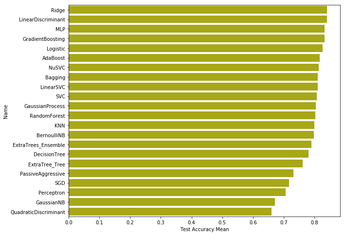


```python
# Learning Curves
fcols = 3
frows = math.ceil(22/fcols)
plt.figure(figsize=(25,7*frows))

for i, [name, model] in enumerate(classifiers):
    train_sizes, train_scores, test_scores = \
        learning_curve(estimator=model, X=X, y=y, train_sizes=np.linspace(0.1, 1, 10), cv=10, n_jobs=-1)
    train_scores_mean = np.mean(train_scores, axis=1)
    train_scores_std = np.std(train_scores, axis=1)
    test_scores_mean = np.mean(test_scores, axis=1)
    test_scores_std = np.std(test_scores, axis=1)
    plt.subplot(frows,fcols,i+1)

    plt.plot(train_sizes, train_scores_mean,
             color='blue', marker='o',
             markersize=5, label='Training accuracy')

    plt.plot(train_sizes, test_scores_mean,
             color='green', linestyle='--',
             marker='s', markersize=5,
             label='Validation accuracy')

    plt.fill_between(train_sizes,
                     train_scores_mean + train_scores_std,
                     train_scores_mean - train_scores_std,
                     alpha=0.15, color='blue')

    plt.fill_between(train_sizes,
                     test_scores_mean + test_scores_std,
                     test_scores_mean - test_scores_std,
                     alpha=0.15, color='green')

    plt.grid()
    plt.title(name)
    plt.xlabel('Number of training samples')
    plt.ylabel('Accuracy')
    plt.legend(loc='best')
    
```


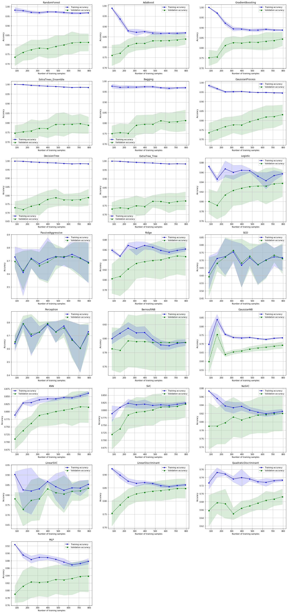


大部分的演算法表現都還不錯，大多有到80%以上的準確率。Learning顯示大部分還是不錯，但有些有overfitting的情況。
我選擇一些表現較優異的演算法來進行預測。


```python
# Voting Classification
hard_vote_model = [
    ('Ridge', RidgeClassifierCV()),
    ('LinearDiscriminant', LinearDiscriminantAnalysis()),
    ('MLP', MLPClassifier()),
    ('GradientBoosting', GradientBoostingClassifier()),
    ('Logistic', LogisticRegressionCV()),
    ('LinearSVC', LinearSVC()),
    ('AdaBoost', AdaBoostClassifier()),
    ('NuSVC', NuSVC(probability=True)),
    ('SVC', SVC(probability=True)),
    ('RandomForest', RandomForestClassifier()),
    ]
# Hard Voting or Soft Voting?
vote_hard = VotingClassifier(estimators=hard_vote_model, voting='hard')
vote_hard_cv = cross_validate(vote_hard, X, y, cv=cv_split)
```


```python
soft_vote_model = [
    ('LinearDiscriminant', LinearDiscriminantAnalysis()),
    ('MLP', MLPClassifier()),
    ('GradientBoosting', GradientBoostingClassifier()),
    ('Logistic', LogisticRegressionCV()),
    ('AdaBoost', AdaBoostClassifier()),
    ('NuSVC', NuSVC(probability=True)),
    ('SVC', SVC(probability=True)),
    ('RandomForest', RandomForestClassifier()),
    ]
vote_soft = VotingClassifier(estimators=soft_vote_model, voting='soft')
vote_soft_cv = cross_validate(vote_soft, X, y, cv=cv_split)
```

在分別執行Hard Voting與Soft Voting分類時，會碰到一些演算法無法使用Soft的情形，例如LinearSVC。這是因為比起LogisticRegression，LinearSVC
沒有辦法像LogisticRegression依樣產生一個機率估算值。因此我直接將其去除，然後進行比較。


```python
Vote_Compare = pd.DataFrame({'Hard-Voting-Train':[vote_hard_cv['train_score'].mean()*100, vote_hard_cv['test_score'].mean()*100]
                            , 'Soft-Voting-Test':[vote_soft_cv['train_score'].mean()*100, vote_soft_cv['test_score'].mean()*100]
                                }, index=['Train', 'Test'])
Vote_Compare
```


<div>
<style scoped>
    .dataframe tbody tr th:only-of-type {
        vertical-align: middle;
    }

    .dataframe tbody tr th {
        vertical-align: top;
    }

    .dataframe thead th {
        text-align: right;
    }
</style>
<table border="1" class="dataframe">
  <thead>
    <tr style="text-align: right;">
      <th></th>
      <th>Hard-Voting-Train</th>
      <th>Soft-Voting-Test</th>
    </tr>
  </thead>
  <tbody>
    <tr>
      <th>Train</th>
      <td>86.875000</td>
      <td>86.931818</td>
    </tr>
    <tr>
      <th>Test</th>
      <td>84.037736</td>
      <td>83.924528</td>
    </tr>
  </tbody>
</table>
</div>


## Tuning  model

這裡開始是我最討厭的部分，因為根據硬體設備不同，調參的成本也會不同(玩到最後發現Kaggle根本就是在比硬體效能的)


```python
grid_n_estimator = [10, 50, 100, 300, 500]
grid_ratio = [.1, .25, .5, .75, 1.0]
grid_learn = [.001, .01, .03, .05, .1, .25, .5]
grid_max_depth = [2, 4, 6, 8, 10, None]
grid_min_samples = [5, 10, .03, .05, .10]
grid_criterion = ['gini', 'entropy']
grid_bool = [True, False]
grid_seed = [0]
```


```python
grid_param = [
    # Ridge
    [{
    }],
    # LinearDiscriminant
    [{
        'n_components':[10, 11, 12, 13, 15, 16, 17, 18, 19, 20]
    }],
    # MLP
    [{
        "alpha":  grid_ratio,
        'solver': ['lbfgs'],
        'max_iter': [1000],
        'random_state': grid_seed
    }],
    # GradientBoosting
    [{
        'learning_rate': grid_learn,
        'n_estimators': grid_n_estimator,
        'max_depth': grid_max_depth,
        'random_state': grid_seed
    }],
    # Logistic
    [{
        'fit_intercept': grid_bool,
        'solver': ['newton-cg', 'lbfgs', 'liblinear', 'sag', 'saga'],
        'random_state': grid_seed
    }],
    # LinearSVC
    [{
        'C': np.logspace(-3, 3, 100),
        'max_iter': [5000]
    }],
    # AdaBoost
    [{
        'n_estimators': grid_n_estimator,
        'learning_rate': grid_learn,
        'random_state': grid_seed
    }],
    # NuSVC
    [{
        'probability':[True] 
    }],
    # SVC
    [{
        'C': np.logspace(-3, 3, 100),
        'probability': [True] ,
        'random_state': grid_seed
    }],
    # RandomForest
    [{
        'n_estimators': grid_n_estimator, 
        'criterion': grid_criterion, 
        'max_depth': grid_max_depth,
        'oob_score': [True]
    }],
]
```


```python
def timer(start_time=None):
    if not start_time:
        start_time = datetime.now()
        return start_time
    elif start_time:
        thour, temp_sec = divmod((datetime.now() - start_time).total_seconds(), 3600)
        tmin, tsec = divmod(temp_sec, 60)
        print('\n Time taken: %i hours %i minutes and %s seconds.' % (thour, tmin, round(tsec, 2)))
```


```python
best_para_hard = []
start_time = timer(None)

for clf, para in zip(hard_vote_model, grid_param):
    best_search = model_selection.GridSearchCV(estimator=clf[1]
                                               , param_grid=para, cv=cv_split, scoring='roc_auc', n_jobs=-1)
    best_search.fit(X, y)
    best_para_hard.append([clf[0], best_search.best_estimator_])
timer(start_time)
```

    
     Time taken: 0 hours 19 minutes and 55.77 seconds.
    


```python
# Hard Voting or Soft Voting?
vote_hard = VotingClassifier(estimators=best_para_hard, voting='hard')
vote_hard_cv = cross_validate(vote_hard, X, y, cv=cv_split)
```


```python
best_para_soft = best_para_hard
best_para_soft.pop(0)
best_para_soft.pop(4)
vote_soft = VotingClassifier(estimators=best_para_soft, voting='soft')
vote_soft_cv = cross_validate(vote_soft, X, y, cv=cv_split)
```


```python
Vote_Compare = pd.DataFrame({'Hard-Voting-Train':[vote_hard_cv['train_score'].mean()*100, vote_hard_cv['test_score'].mean()*100]
                            , 'Soft-Voting-Test':[vote_soft_cv['train_score'].mean()*100, vote_soft_cv['test_score'].mean()*100]
                                }, index=['Train', 'Test'])
Vote_Compare
```


<div>
<style scoped>
    .dataframe tbody tr th:only-of-type {
        vertical-align: middle;
    }

    .dataframe tbody tr th {
        vertical-align: top;
    }

    .dataframe thead th {
        text-align: right;
    }
</style>
<table border="1" class="dataframe">
  <thead>
    <tr style="text-align: right;">
      <th></th>
      <th>Hard-Voting-Train</th>
      <th>Soft-Voting-Test</th>
    </tr>
  </thead>
  <tbody>
    <tr>
      <th>Train</th>
      <td>86.647727</td>
      <td>86.969697</td>
    </tr>
    <tr>
      <th>Test</th>
      <td>84.075472</td>
      <td>83.962264</td>
    </tr>
  </tbody>
</table>
</div>


根據結果，調整過後的準確率到84%左右，WOOOOOOO!!!!!
